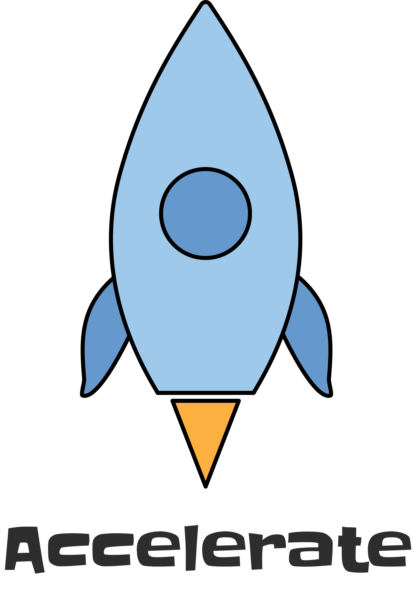

<div align="center">
  
  <h3>
    A starter to facilitate rapid and scalable development using NextJS, Feathers, and Typescript (Under active development...)
  </h3>
  <div>
    Accelerate is a starter project to enable a team to quickly jump past common hurdles, such as login/sign-up pages, and begin solving their core business issues.
  </div>
  <br />

[](https://travis-ci.com/chase-adams/accelerate-starter)
[](https://stats.uptimerobot.com/49G0WUOLW)
[](http://commitizen.github.io/cz-cli/)

</div>

## Getting Started

First, start the MongoDB database using [Docker](https://www.docker.com/).

```
docker run --name accelerate-mongo -d -p 27017:27017 mongo
```

Then, bring up both the web app and API by running:

```bash
yarn install
yarn start
```

This will use [lerna](https://github.com/lerna/lerna) to start each service in the `packages/` folder.

### Web

Also, one can start the web app individually by running:

```bash
cd web/
yarn install
yarn start
```

The web interface is built on NextJS. To learn more about it, visit [nextjs.org](https://nextjs.org/).

### API

Similarly, start the API individually by running:

```bash
cd api/
yarn install
yarn start
```

To learn more about Feathers, visit [feathersjs.com](http://feathersjs.com) or jump right into [the Feathers docs](http://docs.feathersjs.com).

## License

Licensed under the [MIT license](LICENSE).
